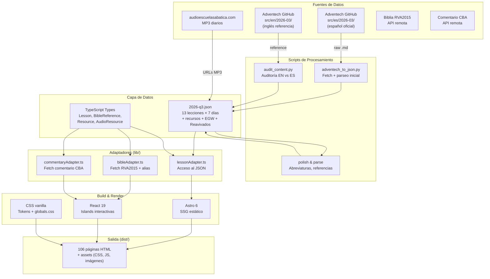
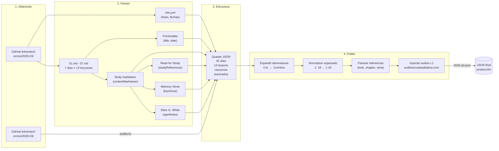
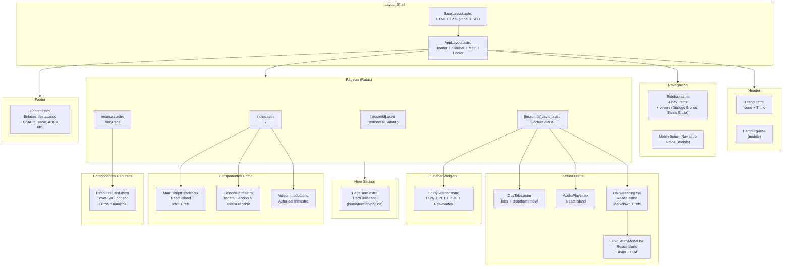
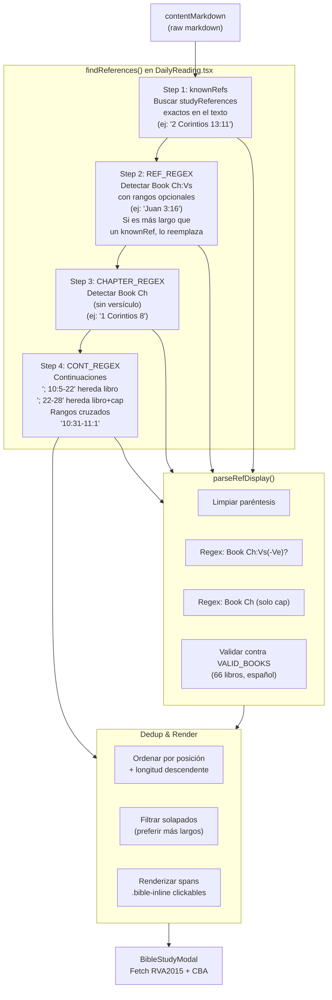
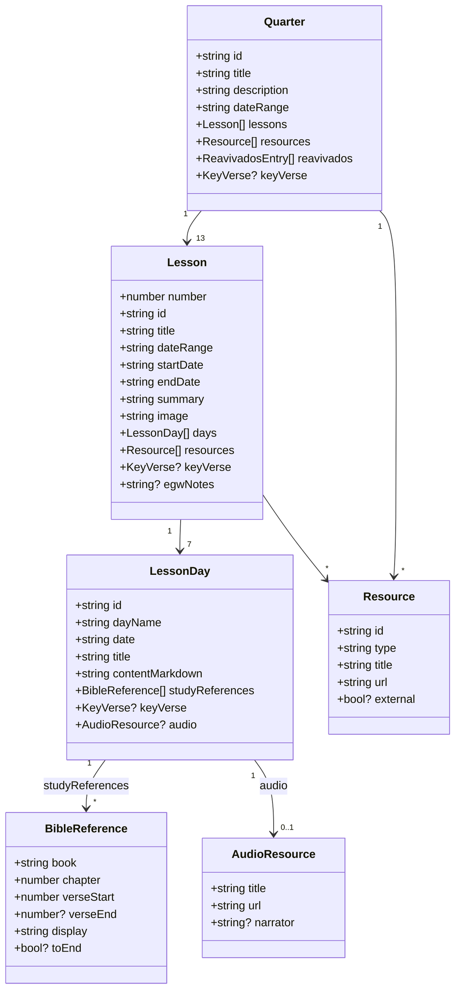
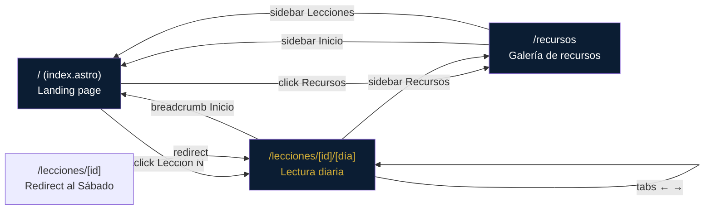
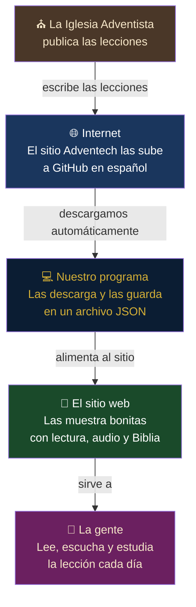

# Diagramas de Arquitectura — Escuela Sabática CL v2.1

## 1. Arquitectura General

## 2. Pipeline de Contenido

## 3. Arquitectura Front-end

## 4. Flujo de Detección de Referencias Bíblicas

## 5. Datos: Estructura del JSON

## 6. Flujo de Navegación (Rutas)

## 7. Arquitectura simplificada

**En cristiano**: La iglesia escribe el folleto trimestral. Adventech lo publica en internet. Un programita nuestro lo descarga automáticamente cada vez que se actualiza. Con eso, el sitio web muestra las lecturas diarias, los audios, los versículos con comentarios, y todo lo que ves en la página. Vos solo entrás, elegís el día, y estudiás.

